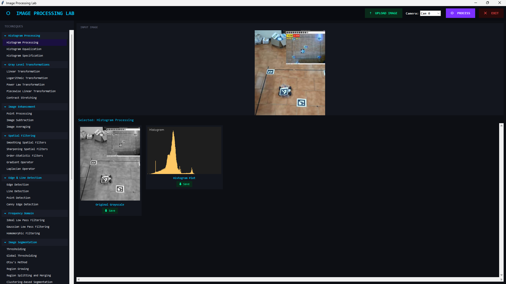

# 🖼️ Image Processor

A desktop application for exploring and applying classical image processing techniques — built with Python and OpenCV.

<p align="center">
  
</p>

---

## 📦 Installation

```bash
pip install opencv-contrib-python numpy pillow
```

> `tkinter` comes built-in with Python. If it's missing, install it via your system package manager.

---

## [Click Here To Download Latest Release](https://github.com/Sudhanva-K-Upadhya/Image-processing-/releases/latest)

---

## 🚀 Usage

```bash
python image_processor.py
```

Load an image, pick a technique from the sidebar, and hit **Apply**.

---

## 🔧 Techniques

| Category | Techniques |
|---|---|
| **Histogram Processing** | Histogram Equalization, CLAHE / Specification |
| **Gray Level Transformations** | Linear, Logarithmic, Power Law, Piecewise, Contrast Stretching |
| **Image Enhancement** | Point Processing, Image Subtraction, Image Averaging |
| **Spatial Filtering** | Smoothing, Sharpening, Order-Statistic, Gradient, Laplacian |
| **Edge & Line Detection** | Canny, Sobel, Line Detection, Point Detection |
| **Frequency Domain** | Ideal LPF, Gaussian LPF, Homomorphic Filtering |
| **Image Segmentation** | Thresholding, Otsu's Method, Region Growing, Watershed |
| **Morphological Operations** | Erosion, Dilation, Opening, Closing, Thinning, Convex Hull |
| **Boundary & Shape** | Edge Linking, Boundary Detection, Polygon Fitting, Shape Detection |
| **Color & Vision** | Gaussian Blur, Color Conversion, Color Masking, Perspective Transform |
| **Live Video & Detection** | ArUco Marker Detection, Motion Detection, Anomaly Detection |

---

## 📚 Libraries

- [`opencv-contrib-python`](https://pypi.org/project/opencv-contrib-python/) — Core image processing and computer vision
- [`numpy`](https://numpy.org/) — Numerical operations and array manipulation
- [`Pillow`](https://python-pillow.org/) — Image display integration with Tkinter
- `tkinter` — GUI framework (Python built-in)

---

## ✨ Features

- 🖥️ Clean dark-themed GUI with scrollable output panel
- 📁 Load any image and apply 40+ processing techniques instantly
- 📷 Live webcam support for real-time detection tasks
- 💾 Save any output image directly from the interface
- 📊 Side-by-side result panels with histograms and intermediate steps

---

## 📁 Project Structure

```
image_processor.py   # Main application
img.jpg              # Sample image (optional)
README.md
```

---

## 📄 License

MIT License
